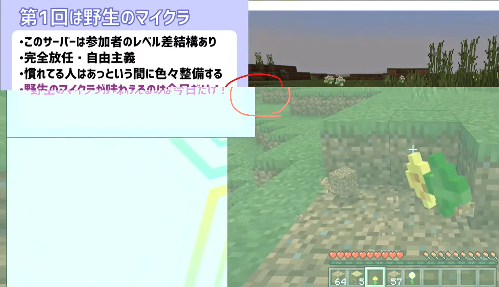

# 2020/8/16

[【Minecraft】みんなでマイクラ ++C++; サーバー #1](https://www.youtube.com/watch?v=DOIUlHmxUqk)

初回配信。

## 配信内容

- シリーズ趣旨の説明: [みんクラ初回説明資料.pptx](みんクラ初回説明資料.pptx)
  - 配信中と同じ見た目にするにはフォントのインストールが必要。コーポレート・ロゴの bold
- ゲームプレイ自体の方の第1回テーマは「野生のマイクラが味わえるのは今日だけ」
  - そのために知っててもあえて参加者に伝えてない豆知識とか結構あり
- 結果的に起きたこと
  - 2時間で廃坑、ダイヤ発見、ネザー行き
  - そこそこちゃんとした家、畑、牧場もできた
  - 物　理　チ　ー　ト　(お子さんの代理プレイ)

## 今回試みたこと

- サムネちゃんとした
  - フリーフォント探したり
    - 今回のは「[コーポレート・ロゴ](https://logotype.jp/corporate-logo-font-dl.html)の bold
  - 文字に縁取り入れたり
  - サムネになりそうなスクショを撮りに行ったり
    - 映えそうなもの(ソウルトーチ、歪んだ木材、トライデント、水流エレベーター)とか
    - 自分の個性が出るもの(島1個削ってる、床が全部収納)とか
  - マイクラ風「++C++ ロゴ」も作った
    - [Textcraft](https://textcraft.net/) 利用
- 事前告知早め
  - [趣旨説明](../readme.md)を1週間前に告知
  - 配信スケジュール(枠取り)を2日前に作成
- 通話しながらの配信
- ゲーム画面 + スライド資料
- ちなみに、今回は計画思いついてから実行までに大体2週間くらい
  - プレイ参加者の人に「こんなのどうかな？」って話したその日に「じゃあ、準備を考えて2週間後で」だけ決めてからスライドとかサムネを準備

## やった感想

- 文字を2重縁取りするとそれっぽく見える説
  - 背景がどんな色でもなじむようにする工夫
- 「普通にやって2・30分くらいのスライド作って、ゲームしながら話すと2時間くらいになるかな」という予測はほぼ当たり
- 思ってたよりも「内部での会話」と「視聴者への説明」が混ざってて配信的にどうだったか…
- しゃべりながらだと思った以上に「脳死プレイ」になる
  - 冒頭から言ってた「たぶん今日の自分は『要介護』対象」予測は当たり
  - あと、自分の脳死プレイは「素手掘り整地」だった
- マルチ楽しい
- 自分だけの配信だとこんなにちゃんとしてないんで「集まる」って方針はよかったと思う

## ミスったと思うこと

- 通話、Teams でやってみたけど結局人に頼った
  - ゲストの呼び方がわからなくて、結局他の人に新しい会議を立ててもらってそこに参加
- 当日告知ツイート忘れてた
- スライドはゲーム画面に被せない方がよかった
  - 「左上くらいはいいかな」と思ってたけど、ゲーム内ログとか座標とかがこの辺りに出るので結構まずそう
  - スライドが1まわり小さくても十分文字が読めてそうなので、小さくしといた方がよかったかも

- マイクラのタイトルバーも消しといたほうがよかったかも
  - 当初想定では、「スライドを話し終えたら全画面モードに切り替え」のつもりでウィンドウキャプチャ
  - 実際には最後までスライドが出っぱなしだったので、タイトルバーは単に邪魔な領域になってた
- サムネ、重要な情報は真ん中付近に集めた方がよさげ
  - 主に twitter 告知を考えて

- 最後に print screen してたスクショ保存し忘れてる
  - クリップボードから貼り付け前に別のものコピーしちゃった ＆ クリップボード履歴は ON にしてない
‐ 「2時間くらいを予定しています」は序盤で話した方がよかった
- マイクラ内ビデオ設定の「画面の揺れ」OFF はやっとくべきだった
  - 「画面の揺れ」ON は酔いやすい

## 次やりたいこと/やらないといけないこと

- 参加者紹介
  - 初回配信の動画内ではあえて参加者の紹介をしてないけど、後からの概要欄編集で参加してくれた人のリンク張りたい
  - 配信内での紹介はいつ、どういう手順でやろう…
- 2回目以降の画面レイアウトどうしよう
  - たぶん、次回からは「今やってることは何」がわかる1行テキストだけでいい気がしてる
    - そうすると、ゲーム画面下に1行分のスペースだけ確保？
- 画面に時計とか出しときたい
  - YouTuber さんのライブ配信で結構よく見る
  - 今回のシリーズ、「大体2時間を区切りに」と時間を決めてるので、時間がわかるようにした方がよさげ
- ハッシュタグとかあった方がいいんだろうけど
  - これは元々気づいてたけど、いいタグが思いつかなかった
- プレイ参加者のグループを用意したい
  - 実は今、個別に連絡取ってる
  - 今いるメンバーだけ相手なら Facebook が一番都合がいいけど…
    - 将来的に公募もあり得ることを考えるとどうしよう
- Discord とか試したい
  - ゲーム方面以外で使われてるのあんまり見ないけど、今回はゲーム配信だし
  - 噂によれば音質いいと聞くけど…
    - 「ゲーム配信するようなスペックの環境同士の通話なら高品質」みたいな前提付く？
- 60 FPS 配信も試してみたい
  - 普段のライブコーディング配信だと FPS が気になることない
  - マイクラだとどのくらい見栄え変わるか
  - あと、うちの回線とかが大丈夫か
- ゲーム内ルールある程度決めたい
  - 初回配信は「野生のマイクラ」テーマだったのであえて決めてない＆伝えてない
