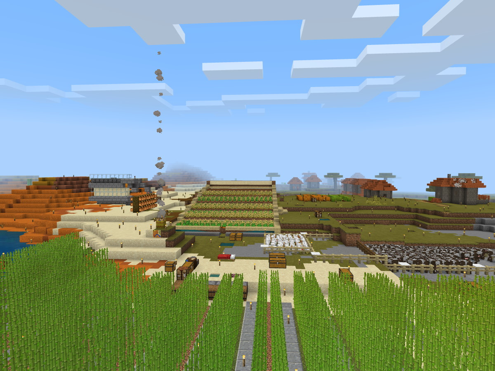
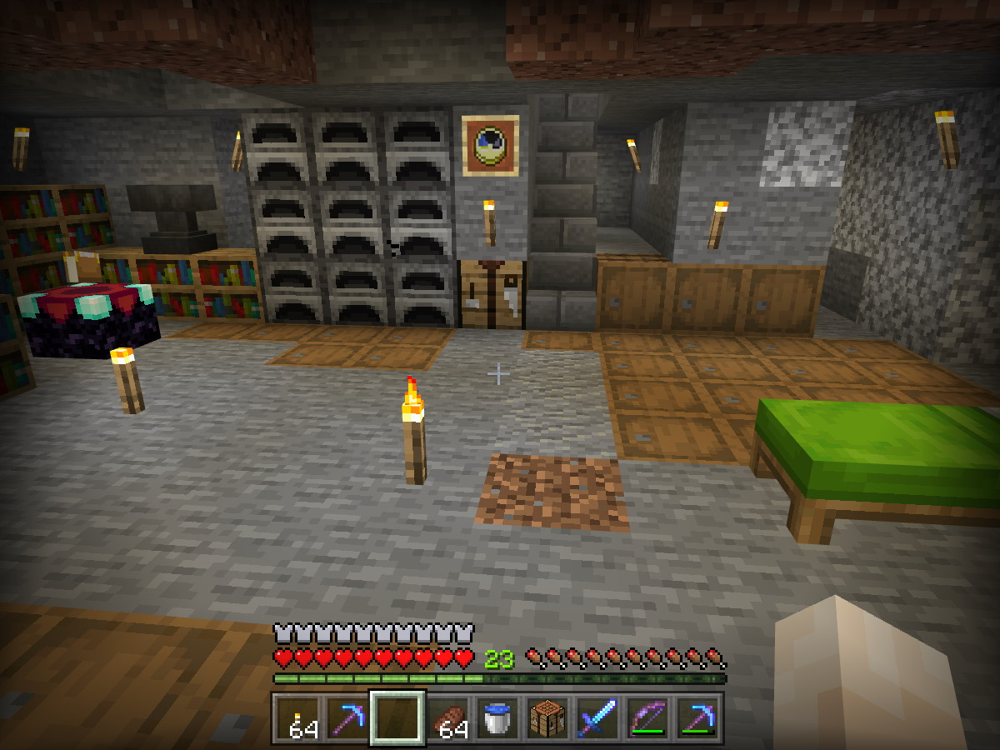
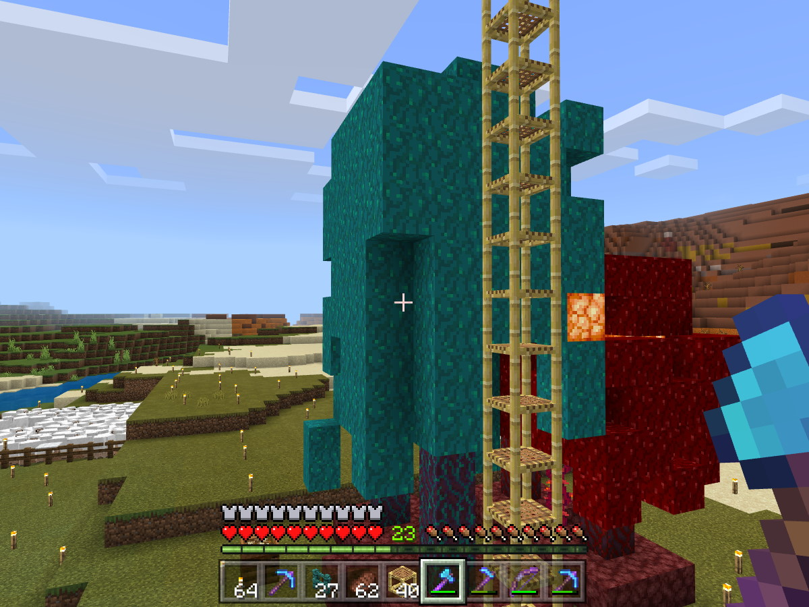
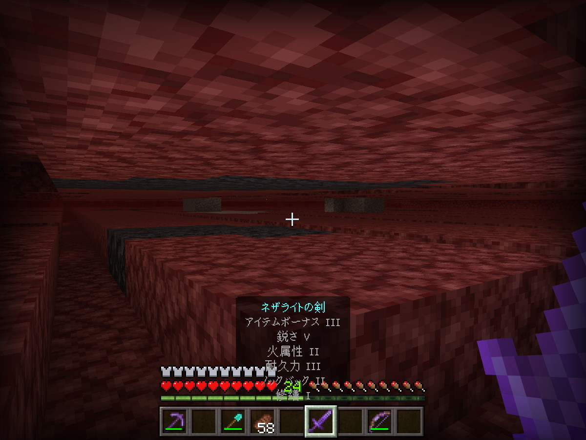

# みんなでマイクラ

週1程度を目標にマイクラのライブ配信をします。

※初回サムネは「以前やっていた別ワールド」からのスクショ流用です。新規ワールドで開始する予定。

## 配信趣旨

趣旨としては「オンラインでしゃべる場」の提供です。
マイクラなのは「主催者がやりやすいから」です。

「配信側都合」なライブ配信企画ではあります。

しいて言うならお見せできるもの:

- ソフトウェアエンジニアが集まってマイクラをやるとどうなるか
- それなりの経験者が初心者に教えながらのマイクラ

## 背景

### 個人的な都合

問題:

- C# 関連のネタがある2・3週に1回の配信だとちょっと間隔開きすぎな感じ
  - 配信頻度が低いとその都度、開始時の心的ハードルが高い

解決策としてやりたいこと:

- 気楽にできるネタを一定ペースで、週1程度で流したい

### コミュニティ的な都合

問題:

- 「オンライン化をしてみたいけど1人だとハードルが高い」という人が多い
  - 独り言しゃべってるような感覚がつらい
  - 配信環境に自信がない
- 元々登壇経験がある人でもそんな風になってる中、新しい人はどう入ればいいのか

解決策としてやりたいこと:

- 定期的にしゃべる場にしたい
- オンライン通話しながらの配信の練習にしたい
- 「そういう活動をやってる」というのを出し続けたい

## レギュレーション

### 参加者について

ハードルを下げることが目的なので、色々な人が参加できるようにします。

- 映りたくない人 → ユーザー名(ゲーマータグ)、アバター(キャラクター)には気を付けてください
- 施設を映してほしい人 → どこに何を作ったかの報告をお願いします
- 各人の個人配信で使ってもらってもOK
- マイクラ以外で配信してみたい人が出てきたらそれも受け付け

### マイクラ自体のプレイ方針

- 統合版(Java じゃないやつ/Switch とかでもプレイできるやつ)を利用
- サバイバル、難易度ノーマル
  - チートはオン
    - コマンド、アイテム生成を使うのは初心者講習・救済用途のみのつもり
    - オペレーター権限(コマンド使用)は主催者のみ
- それぞれ自由行動
  - 景観とか文明水準とか気にせずみんな好きなように
  - 「みんなで何かやりたい」みたいな話は都度相談

## 参考資料

以下、参考資料として、主催者が直近でプレイしていた別ワールドの個人拠点のスクショ。

